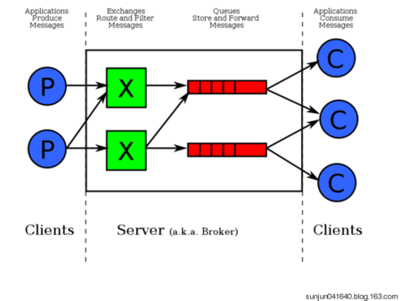

## RabbitMQ

基础概念http://www.jianshu.com/p/b26336fd1e90

MQ主要用来解决两个或多个系统需要同步数据，异构系统的不同进程互相调用，通讯。

AMQP，即Advanced Message Queuing Protocol，高级消息队列协议，是应用层协议的一个开放标准，为面向消息的中间件设计。消息中间件主要用于组件之间的解耦，消息的发送者无需知道消息使用者的存在，反之亦然。AMQP的主要特征是面向消息、队列、路由（包括点对点和发布/订阅）、可靠性、安全。RabbitMQ是一个开源的AMQP实现，服务器端用Erlang语言编写。主要是用来实现应用程序的异步和解耦，同时也能起到消息缓冲，消息分发的作用。默认启动端口 5672。



左侧代表生产者Producer 往RabbitMQ发送消息

中间即RabbitMQ，包括了交换机和队列

右侧代表消费者Customer，从RabbitMQ拿消息

下面有几个比较重要的概念

虚拟主机：一个虚拟主机有一组交换机，队列和绑定。为什么需要多个虚拟主机呢，在RabbitMQ中，用户只能在虚拟主机的粒度进行权限控制，因此，如果需要静止A组访问B组的交换机／队列／绑定，必须为A和B分别创建一个虚拟主机

交换机：Exchange用于转发消息，它不会做储存，如果没有Queue bind到Exchange的话，他会直接丢弃掉Producer发送过来的消息

路由键：消息到交换机的时候，交互机会转发到对应的队列中，那么究竟转发到哪个队列，就要根据该路由键。

绑定：交换机需要和队列相绑定，这其中如上图所示，是多对多的关系。


1.RabbitMQ下载https://www.rabbitmq.com/

2.我是mac下的，运行项目目录下的 sbin/rabbitmq-server

3.命令行中出现以下错误

ERROR: epmd error for host RaydeMacBook-Pro: timeout (timed out)

这个错误是因为找不到 RaydeMacBook-Pro 这个对应的ip，去host文件中添加

127.0.0.1  RaydeMacBook-Pro 

这么一行就ok了

4.创建一个maven的项目，添加依赖

```xml
    <dependencies>

        <!-- https://mvnrepository.com/artifact/com.rabbitmq/amqp-client -->
        <dependency>
            <groupId>com.rabbitmq</groupId>
            <artifactId>amqp-client</artifactId>
            <version>4.1.0</version>
        </dependency>

        <!-- 序列化相关依赖 -->
        <dependency>
            <groupId>commons-lang</groupId>
            <artifactId>commons-lang</artifactId>
            <version>2.6</version>
        </dependency>
    </dependencies>

```

5.设置生产者和消费者，见代码helloworld/Recv.java & Send.java

6.Spring Boot整合RabbitMQ，见helloSpring/